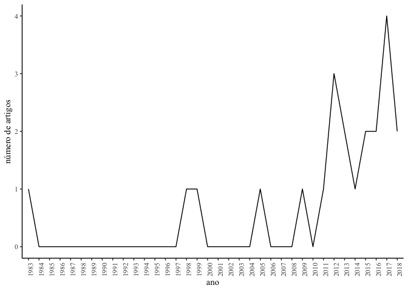
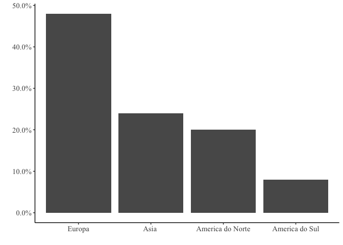
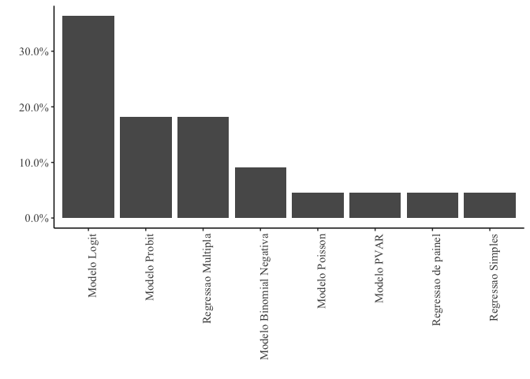
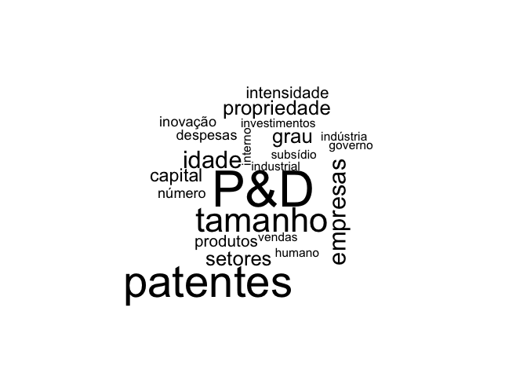

ANÁLISE E DISCUSSÃO DOS RESULTADOS
----------------------------------

### Evolução das publicações

### Distribution of the articles by investigated countries

    paises  <- str_split(artigos$pais_de_investigacao, ",", simplify = TRUE)
    paises <- as.vector(paises)
    paises <- as.factor(paises[str_count(paises)>0])

    tab <- tabyl(paises) %>%
      adorn_pct_formatting(affix_sign = FALSE) %>%
      arrange(desc(n)) %>%
      adorn_totals()

    colnames(tab)  <- c("pais", "Numero de artigos",  "%")
    tab[tab$pais=="Total", 3] <- "100"

    knitr::kable(tab)

<table>
<thead>
<tr class="header">
<th align="left">pais</th>
<th align="right">Numero de artigos</th>
<th align="left">%</th>
</tr>
</thead>
<tbody>
<tr class="odd">
<td align="left">EUA</td>
<td align="right">4</td>
<td align="left">16.0</td>
</tr>
<tr class="even">
<td align="left">China</td>
<td align="right">3</td>
<td align="left">12.0</td>
</tr>
<tr class="odd">
<td align="left">Espanha</td>
<td align="right">3</td>
<td align="left">12.0</td>
</tr>
<tr class="even">
<td align="left">Brasil</td>
<td align="right">2</td>
<td align="left">8.0</td>
</tr>
<tr class="odd">
<td align="left">Holanda</td>
<td align="right">2</td>
<td align="left">8.0</td>
</tr>
<tr class="even">
<td align="left">Italia</td>
<td align="right">2</td>
<td align="left">8.0</td>
</tr>
<tr class="odd">
<td align="left">Canada</td>
<td align="right">1</td>
<td align="left">4.0</td>
</tr>
<tr class="even">
<td align="left">Europa</td>
<td align="right">1</td>
<td align="left">4.0</td>
</tr>
<tr class="odd">
<td align="left">Franca</td>
<td align="right">1</td>
<td align="left">4.0</td>
</tr>
<tr class="even">
<td align="left">Alemanha</td>
<td align="right">1</td>
<td align="left">4.0</td>
</tr>
<tr class="odd">
<td align="left">Canada</td>
<td align="right">1</td>
<td align="left">4.0</td>
</tr>
<tr class="even">
<td align="left">Coreia</td>
<td align="right">1</td>
<td align="left">4.0</td>
</tr>
<tr class="odd">
<td align="left">Italia</td>
<td align="right">1</td>
<td align="left">4.0</td>
</tr>
<tr class="even">
<td align="left">Japao</td>
<td align="right">1</td>
<td align="left">4.0</td>
</tr>
<tr class="odd">
<td align="left">Taiwan</td>
<td align="right">1</td>
<td align="left">4.0</td>
</tr>
<tr class="even">
<td align="left">Total</td>
<td align="right">25</td>
<td align="left">100</td>
</tr>
</tbody>
</table>

### Distribution of the articles by investigated regions

    continentes  <- str_split(artigos$continente, ",", simplify = TRUE)
    continentes <- str_replace_all(as.vector(continentes), "^ +", "")
    continentes <- continentes[str_count(continentes)>0]
    dados <- tabyl(continentes)

    p <- ggplot(dados, aes(x = reorder(continentes, -percent), y = percent)) +
      geom_bar(stat = "identity") +
      scale_y_continuous(labels = scales::percent_format())

    p + theme_classic() +  theme(text=element_text(family="Times New Roman", size=11), axis.text = element_text(family="Times New Roman", size=11))  + 
      xlab(" ") + ylab(" ") 

### Distribution of the articles by journal

    journal <- artigos$fonte

    tab <- tabyl(journal) %>%
      adorn_pct_formatting(affix_sign = FALSE) %>%
      arrange(desc(n)) %>%
      adorn_totals()

    colnames(tab)  <- c("Revista", "Numero de artigos",  "%")
    tab[tab[,1]=="Total", 3] <- "100"

    knitr::kable(tab)

<table>
<thead>
<tr class="header">
<th align="left">Revista</th>
<th align="right">Numero de artigos</th>
<th align="left">%</th>
</tr>
</thead>
<tbody>
<tr class="odd">
<td align="left">Research Policy</td>
<td align="right">4</td>
<td align="left">18.2</td>
</tr>
<tr class="even">
<td align="left">Journal of Engineering and Technology Management - JET-M</td>
<td align="right">3</td>
<td align="left">13.6</td>
</tr>
<tr class="odd">
<td align="left">Technovation</td>
<td align="right">3</td>
<td align="left">13.6</td>
</tr>
<tr class="even">
<td align="left">Journal of Family Business Strategy</td>
<td align="right">2</td>
<td align="left">9.1</td>
</tr>
<tr class="odd">
<td align="left">China Economic Review</td>
<td align="right">1</td>
<td align="left">4.5</td>
</tr>
<tr class="even">
<td align="left">EMJ - Engineering Management Journal</td>
<td align="right">1</td>
<td align="left">4.5</td>
</tr>
<tr class="odd">
<td align="left">Eurasian Economic Review</td>
<td align="right">1</td>
<td align="left">4.5</td>
</tr>
<tr class="even">
<td align="left">German Economic Review</td>
<td align="right">1</td>
<td align="left">4.5</td>
</tr>
<tr class="odd">
<td align="left">Innovation: Management, Policy and Practice</td>
<td align="right">1</td>
<td align="left">4.5</td>
</tr>
<tr class="even">
<td align="left">International Journal of Biotechnology</td>
<td align="right">1</td>
<td align="left">4.5</td>
</tr>
<tr class="odd">
<td align="left">Journal of Econometrics</td>
<td align="right">1</td>
<td align="left">4.5</td>
</tr>
<tr class="even">
<td align="left">Management Decision</td>
<td align="right">1</td>
<td align="left">4.5</td>
</tr>
<tr class="odd">
<td align="left">Production</td>
<td align="right">1</td>
<td align="left">4.5</td>
</tr>
<tr class="even">
<td align="left">Sustainability (Switzerland)</td>
<td align="right">1</td>
<td align="left">4.5</td>
</tr>
<tr class="odd">
<td align="left">Total</td>
<td align="right">22</td>
<td align="left">100</td>
</tr>
</tbody>
</table>

### Statistical and econometric techniques used to study innovation.

    modelos <- artigos$metodo
    modelos <- as.factor(modelos)

    dados <- tabyl(modelos)

    p <- ggplot(dados, aes(x = reorder(modelos, -percent), y = percent)) +
      geom_bar(stat = "identity") +
      scale_y_continuous(labels = scales::percent_format())

    p  +theme_classic() +  theme(axis.text.x = element_text(angle=90, hjust=1), text=element_text(family="Times New Roman", size=11), axis.text = element_text(family="Times New Roman", size=11))  + 
      xlab(" ") + ylab(" ") 

### Wordcloud das variaveis

    aux <- artigos$variaveis 
    aux <- str_replace_all(aux, ",", "")
    aux <- str_replace_all(aux, "\n", " ")
    aux <- removeWords(aux, stopwords("pt"))
    aux <- str_replace_all(aux, "  ", " ")
    aux <- str_replace_all(aux, "\\(", "")
    aux <- str_replace_all(aux, "\\)", "")
    aux <- str_replace_all(aux, "\\.", "")
    aux <- unlist(str_split(aux, " "))
    aux <- aux[str_count(aux)>1]
    sele <- str_detect(aux, "[:upper:][:lower:]+")
    aux[sele] <- str_to_lower(aux[sele])

    tmp <- stemDocument(aux, language = "pt")

    aux2 <- summary(as.factor(tmp))
    word_count <- cbind(word=stemCompletion(names(aux2), aux), count=aux2)
    word_count <- as.data.frame(word_count)
    word_count$count <- as.numeric(as.character(word_count$count))

    wordcloud(word_count$word[1:50], word_count$count[1:50])

 \#\#\# determinants
of innovation

    artigos %>%
      dplyr::select(variaveis, autores) -> tab

    knitr::kable(tab)

<table>
<thead>
<tr class="header">
<th align="left">variaveis</th>
<th align="left">autores</th>
</tr>
</thead>
<tbody>
<tr class="odd">
<td align="left">Estrutura de Propriedade, Intensidade de Capital , Grau de Monopólio, idade , tamanho, intensidade de P&amp;D, patentes aplicadas , patentes concedidas, Empréstimo Financeiro, Subsídio Direto do Governo, e Subsídio Governamental Indireto</td>
<td align="left">Guan, JianCheng e Pang, Lanxin</td>
</tr>
<tr class="even">
<td align="left">Patentes, programas de subsídios de patentes, P&amp;D, população, Produto Interno Bruto, impacto da alteração da lei de patentes</td>
<td align="left">Li, Xibao</td>
</tr>
<tr class="odd">
<td align="left">o grau de concorrência no mercado, grau de desregulamentação, grau de aplicação dos direitos de propriedade intelectual, grau de informação</td>
<td align="left">Blazsek, Szabolcs e Escribano, Alvaro</td>
</tr>
<tr class="even">
<td align="left">Nº de patentes, P&amp;D, Codificabilidade do conhecimento, Observabilidade do conhecimento, esfroço interno e externo P&amp;D, tamanho, idade, indústria</td>
<td align="left">Prez-Luo, Ana e Valle-Cabrera, Ramn</td>
</tr>
<tr class="odd">
<td align="left">Localização Alemanha, patentes, sigilo, licenciamento</td>
<td align="left">Arundel, Anthony e Kabla, Isabelle</td>
</tr>
<tr class="even">
<td align="left">tamanho das empresas, o agrupamento e o mix de produtos / serviços, numero de patentes.</td>
<td align="left">Chabchoub, Norhne e Niosi, Jorge</td>
</tr>
<tr class="odd">
<td align="left">vencedores dos produtos do P&amp;D 100, patentes do USPTO, indústrias, áreas geográficas, organizações</td>
<td align="left">Fontana, Roberto e Nuvolari, Alessandro e Shimizu, Hiroshi e Vezzulli, Andrea</td>
</tr>
<tr class="even">
<td align="left">propensão ao patenteamento , gastos com P&amp;D, redes de colaboração nacional regional e internacional</td>
<td align="left">Bolvar-Ramos, Mara Teresa</td>
</tr>
<tr class="odd">
<td align="left">n patentes, empregados regulares , proporção de empregados não regulares, tamanho, idaade, capital social, despesas P&amp;D, intesidade de competição</td>
<td align="left">Kato, Masatoshi e Zhou, Haibo</td>
</tr>
<tr class="even">
<td align="left">número de pedidos de patente, tamanho da empresa , esforço de P&amp;D, teconologia, capital humano, inovação de produtos e processo, universidades, instituições, governo</td>
<td align="left">Huang, Kuo-Feng e Cheng, Tsung-Chi</td>
</tr>
<tr class="odd">
<td align="left">tamanho, idade, restrições financeiras, lucratividade e produtividade, indústria, número de pedidos de patentes e as despesas de P&amp;D das firmas, propriedade, estrutura de goernançã e sucessores.</td>
<td align="left">Bann, Mariasole</td>
</tr>
<tr class="even">
<td align="left">tamanho da empresa, capacidade inovadora, grau de competição, apoio do governo, parcerias de inovação, novas praticas de gestão, propriedade</td>
<td align="left">Barros, Henrique M.</td>
</tr>
<tr class="odd">
<td align="left">despesas de P&amp;D, vendas , linhas de negocio, setor industrial , número de patentes</td>
<td align="left">Scherer, FM</td>
</tr>
<tr class="even">
<td align="left">tamanho da empresas, colaboraçãode P&amp;D , pesquisa, intensidade de P&amp;D, setores alta intensidade tecnológica, vendas</td>
<td align="left">Brouwer, Erik e Kleinknecht, Alfred</td>
</tr>
<tr class="odd">
<td align="left">patente, propriedade da empresa, ativos intangiveis, financiamento interno, finnciamento externo, tamanho, idade, setores, localização</td>
<td align="left">Succurro, M. e Costanzo, GD</td>
</tr>
<tr class="even">
<td align="left">setor industrial, empresa inovadaora, idade , divisão de pesquisa, patentes, CEO</td>
<td align="left">Han, J.</td>
</tr>
<tr class="odd">
<td align="left">tamanho, idade, despesa com P&amp;D, patentes, plano de inovação formal, capital humano</td>
<td align="left">Agostini, L. e Nosella, A.</td>
</tr>
<tr class="even">
<td align="left">tamanho, sigilo, idade, setores industriais, gestão pessoal P&amp;D. direitos de propriedade das</td>
<td align="left"></td>
</tr>
<tr class="odd">
<td align="left">Processo de P&amp;D,</td>
<td align="left"></td>
</tr>
<tr class="even">
<td align="left">funcionarios , estatal</td>
<td align="left"></td>
</tr>
<tr class="odd">
<td align="left">ou empresas de participação acionária (SOE), estrangeiras ou</td>
<td align="left"></td>
</tr>
<tr class="even">
<td align="left">ventures (FJV), de propriedade privada ou</td>
<td align="left"></td>
</tr>
<tr class="odd">
<td align="left">empresas holding. Li, X. e Ni, H.</td>
<td align="left"></td>
</tr>
<tr class="even">
<td align="left">Intensidade P&amp;D, patentes, subsdios P&amp;D . Tamanho , idade, capital humano, vendas, importações , exportações , insumos</td>
<td align="left">Alecke, B. e Mitze, T. e Reinkowski, J. e Untiedt, G.</td>
</tr>
<tr class="odd">
<td align="left">tamanho, exportação, a origem do capital, investimentos em (P&amp;D) , laboratório específico de P&amp;D, cooperação em P&amp;D, fontes de informação.</td>
<td align="left">Pacagnella Jnior, AC e Porto, GS e Kannebley Jnior, S. e da Silva, SL e Bonacim, CAG</td>
</tr>
<tr class="even">
<td align="left">nº de acordo de colaboração, financiamento privado e apoio de empresas de biotecnologia, fundos recebidos da família e de outros investidores providenciais, financiamaneto governamental, tamanho , idade, setores industriais, receitas geradas, estratégias de PI, investimentos em P&amp;D</td>
<td align="left">Beaudry, C.</td>
</tr>
<tr class="odd">
<td align="left">número total de patentes concedidas e registradas na Espanha,</td>
<td align="left"></td>
</tr>
<tr class="even">
<td align="left">Patents and Trademarks Office, investimento em P&amp;D, setor industrial, grau de codificação Prez-Cano, C. e Villn-Altamirano, J.</td>
<td align="left"></td>
</tr>
</tbody>
</table>
